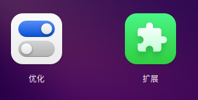
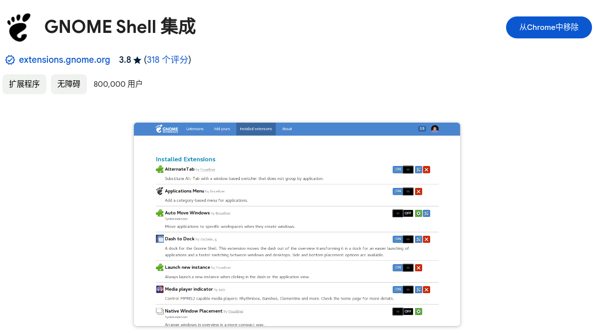
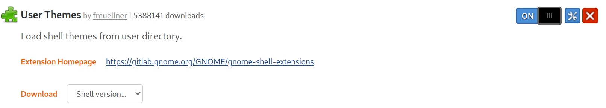
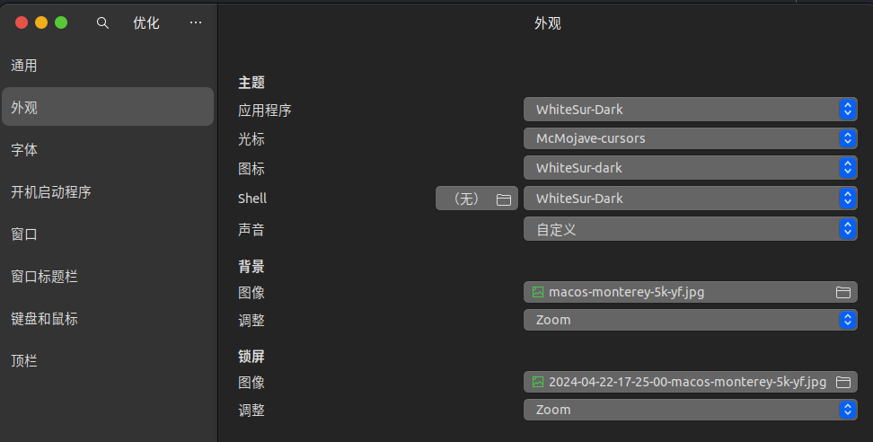

# Macuntu theme

1.首先安装优化、扩展。
```bash
sudo apt install gnome-tweaks gnome-shell-extensions
```




2.chrome或者Edge浏览器安装gnome-shell插件：
https://chromewebstore.google.com/detail/gnome-shell-%E9%9B%86%E6%88%90/gphhapmejobijbbhgpjhcjognlahblep?pli=1



3.完成后打开
https://extensions.gnome.org/extension/19/user-themes/ 
完成后可以方可配置主题包。



4.下载主题包

主题：
https://github.com/vinceliuice/WhiteSur-gtk-theme

图标：
https://github.com/vinceliuice/WhiteSur-icon-theme

鼠标：
https://github.com/vinceliuice/McMojave-cursors

**通过git clone或者下载Releases(鼠标没有Releases只能clone)**

```bash
cd WhiteSur-gtk-theme/ # 主题文件夹
sudo ./install.sh -d /usr/share/themes/ -m
sudo ./tweaks.sh -g -b "/usr/share/backgrounds/壁纸(需手动修改).png"  

cd WhiteSur-icon-theme/ # 图标文件夹
sudo ./install.sh -d /usr/share/icons/ -b

cd McMojave-cursors/ # 鼠标文件夹
sudo ./install.sh
```

然后按照下图配置：



